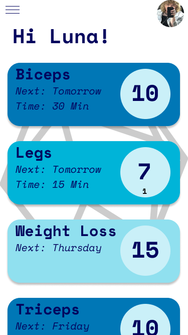
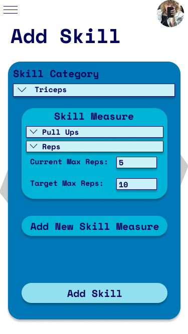

# Level 20 Fitness

## Description

Level 20 Fitness is a fitness app that tracks your progress to a goal in the form of a level progression system from levels 1 to 20. The program is built from a react native front end and a python flask back end and support multiple users each with a one to many relationship to workouts or 'Skills' as they are called in the program.

## Languages Used

React Native, React, Flask, Python.

## Mockups

## Future Improvements

1. Add Settings
2. Add Edit Skill Capabilities
3. Publish to App Store
4. Fix Bug with the front-end continually pinging the back end preventing heroku from working.
5. Add Workouts through a workout API to show users how to do certain exercises
6. Profile Pictures
7. Add Further Gamification of Workouts
8. And Many More!